# ReactJS

React is one of the popular Javascript libraries and it’s going to be more popular in 2019 and beyond. React is released first in 2013 and it gained a lot of popularity over the years. It’s a declarative, component-based and efficient javascript library for building user interfaces.


Here are the topics you must know before your interview.

- **What is Declarative Programming**
- **Declarative Programming vs Imperative Programming?**
- **What is Functional Programming**
- **What is Component Design Pattern**
- **What is React**
- **How Does It Differ from Angular**
- **What is Virtual DOM and How it works**
- **What is JSX**
- **Components and Different Types**
- **Props and State**
- **What are PropTypes**
- **How to Update State and How not to**
- **Component Lifecycle Methods**
- **Composition Over Inheritance**
- **How to Apply Styles In React**
- **What is Redux and How It Works**
- **What is React Router and How It Works**
- **What are Error Boundaries**
- **What are Fragments**
- **What are Portals**
- **What is Context**
- **What are Hooks**
- **How to Improve Performance**
- **How to Persist data when reloading the page**
- **How do you make an API call from React**


### What is Declarative Programming

Declarative Programming is a programming paradigm which focuses on **what**you do rather than **how** you do. It expresses the logic without explicitly defining the steps. What it means is we need to declare the components what to display depending on the computation of logic. It doesn’t describe the control flow steps. Examples of declarative programming are HTML, SQL, etc.

```html
<!-- test.html -->
<div>
  <p>Declarative Programming</p>
</div>
```


```sql
/* test.sql */
select * from studens where firstName = 'declarative';
```


### Declarative Programming vs Imperative Programming?

Declarative Programming is written in such a way that it describes what should be done whereas Imperative Programming describes how to do it. In Declarative Programming you let the compiler decide how to do things. Declarative Programs are easy to reason because the code itself describes what it is doing.

Here is an example where I want to increment each element in the array, with declarative we are using map function and let the compiler do the rest and with imperative we are writing all the control flow steps.


```javascript
// test.js
// **********
const numbers = [1,2,3,4,5];

// declarative programming
const doubleWithDec = numbers.map(number => number * 2);

console.log(doubleWithDec)

// imperative programming
const doubleWithImp = [];
for(let i=0; i<numbers.length; i++) {
    const numberdouble = numbers[i] * 2;
    doubleWithImp.push(numberdouble)
}

console.log(doubleWithImp)
```


### What is Functional Programming

Functional programming is a part of declarative programming. Functions in javascript are first class citizens which mean functions are data and you can save, retrieve, and pass these functions throughout your application just like variables.

There are some core concepts for the programming to be functional. Here are those

- **Immutability**
- **Pure Functions**
- **Data Transformations**
- **Higher-Order Functions**
- **Recursion**
- **Composition**

#### **Immutability**

Immutability means unchangeable. In functional programming, you can’t change the data and it never changes. If you want to mutate or change the data, you have to copy the data and change the copied version and use it.

For instance, here is a **student** object and **changeName** function and if you want to change the name of the student, you need to copy the student object first and then return the new object.

In javascript, function arguments are references to actual data you should not do this `student.firstName = "testing11".` This will mutate the actual student object instead, you should use `Object.assign` to copy the object and return the new object.


```javascript
// test.js
let student = {
    firstName: "testing",
    lastName: "testing",
    marks: 500
}

function changeName(student) {
    // student.firstName = "testing11" //should not do it
    let copiedStudent = Object.assign({}, student);
    copiedStudent.firstName = "testing11";
    return copiedStudent;
}

console.log(changeName(student));

console.log(student);
```


#### Pure Functions

Pure Functions are the functions which always takes one or more arguments and computes on arguments and returns data or functions. It doesn’t have side effects such as setting global state, changing the application state and it always treats arguments as immutable data.

I want to add an address to the student object with the function called **appendAddress.** If you look at the first version of an impure function it doesn’t have an argument, It changes the global state or application state by changing the student object directly.

If you look at the second version, it takes the argument, computes based on argument, returns a new object without mutating the argument.


```javascript
// test.js
// *******
let student = {
    firstName: "testing",
    lastName: "testing",
    marks: 500
}

// impure function
function appendAddress() {
    student.address = {streetNumber:"0000", streetName: "first", city:"somecity"};
}

console.log(appendAddress());

// pure function
function appendAddress(student) {
    let copystudent = Object.assign({}, student);
    copystudent.address = {streetNumber:"0000", streetName: "first", city:"somecity"};
    return copystudent;
}

console.log(appendAddress(student));

console.log(student);
```


#### Data Transformations

We are talking a lot about immutability so how do we change data if the data is immutable. As discussed above, we always produce transformed copies of the original instead of directly changing the original data.

We will look at some of the javascript built-in functions for this. There is a lot of other functions as well and here are some examples. All these functions don’t change the existing data instead it returns new arrays or objects.


```javascript
// test.js
// ********
let cities = ["irving", "lowell", "houston"];

// we can get the comma separated list
console.log(cities.join(','))
// irving,lowell,houston

// if we want to get cities start with i
const citiesI = cities.filter(city => city[0] === "i");
console.log(citiesI)
// [ 'irving' ]

// if we want to capitalize all the cities
const citiesC = cities.map(city => city.toUpperCase());
console.log(citiesC)
// [ 'IRVING', 'LOWELL', 'HOUSTON' ]
```


#### **Higher-Order Functions**

Higher order functions are the functions which take functions as an argument or return functions or sometimes they do both. These higher-order functions can manipulate other functions.

`Array.map, Array.filter and Array.reduce`are the higher order functions since they take functions as arguments


```javascript
// test.js
// *******
const numbers = [10,20,40,50,60,70,80]

const out1 = numbers.map(num => num * 100);
console.log(out1);
// [ 1000, 2000, 4000, 5000, 6000, 7000, 8000 ]

const out2 = numbers.filter(num => num > 50);
console.log(out2);
// [ 60, 70, 80 ]

const out3 = numbers.reduce((out,num) => out + num);
console.log(out3);
// 330
```

Here is another example for the higher-order function called **isPersonOld**which takes two other functions called **message** and **isYoung** and manipulate and return data.

```javascript
// test2.js
// ********
const isYoung = age => age < 25;

const message = msg => "He is "+ msg;

function isPersonOld(age, isYoung, message) {
    const returnMessage = isYoung(age)?message("young"):message("old");
    return returnMessage;
}

// passing functions as an arguments
console.log(isPersonOld(13,isYoung,message))
// He is young
```


#### **Recursion**

Recursion is a technique where the function calls itself until a certain condition is met. It’s better to use Recursion instead of loops whenever possible. You have to be careful with this since browsers can’t handle too much recursion and throw errors.

Here is an example to demonstrate the recursion where we are printing a name like a staircase. We can do with for loop as well but, always prefer recursion whenever possible.


```javascript
// recursion.js
// ************

function printMyName(name, count) {
    if(count <= name.length) {
        console.log(name.substring(0,count));
        printMyName(name, ++count);
    }
}

console.log(printMyName("Bhargav", 1));

/*
B
Bh
Bha
Bhar
Bharg
Bharga
Bhargav
*/

// withotu recursion
var name = "Bhargav"
var output = "";
for(let i=0; i<name.length; i++) {
    output = output + name[i];
    console.log(output);
}
```


#### Composition

In React, we divide the features into small reusable pure functions and we have to put all these reusable functions together to make it a product eventually. Combining all the smaller functions into larger functions and eventually, you would get an application. This is called composition.

There are a lot of different implementations and methods to implement composition. One of the familiar methods that we know from Javascript is chaining. Chaining is a method to invoke a function on the return value of the previous function with the dot notation.

Here is an example of it. We have a name and I want to return if firstName and lastName are greater than 5 words with a capital case and also I want to print the name and length of the name.


```javascript
// composition.js
// **************

const name = "Bhargav Bachina";

const output = name.split(" ")
    .filter(name => name.length > 5)
    .map(val => {
    val = val.toUpperCase();
    console.log("Name:::::"+val);
    console.log("Count::::"+val.length);
    return val;
});

console.log(output)
/*
Name:::::BHARGAV
Count::::7
Name:::::BACHINA
Count::::7
[ 'BHARGAV', 'BACHINA' ]
*/
```


In React, we use a different method other than chaining because it is hard to do chaining if you have more functions like 30. **The goal here is combining all simpler functions to generate a higher order function.**


```javascript
// simple.js
// *********

const name = compose(
    splitmyName,
    countEachName,
    comvertUpperCase,
    returnName
)

console.log(name);
```


### What is React

React is a simple javascript UI library for building efficient and faster user interfaces. It’s a lightweight library which makes it popular. It follows the component design pattern, declarative programming paradigm, and functional programming concepts to make the front end apps efficient. It uses Virtual DOM to efficiently manipulates DOM. It follows one-way data flow from higher order components to lower order components.


### How does it differ From Angular

Angular is a full blown MVC framework and comes with a lot of opinionated features such as services, directives, templates, modules, resolvers, etc. React is very lightweight lib which focusses only on view part of MVC. Angular follows two directional data flow whereas React follows uni-directional data flow which is top to down approach. React gives a lot of freedom to the developers when it comes to developing features, for example, the way we call API, routing, etc. We don’t have to include router lib unless we need it in our project.


### **What is Virtual DOM and How it works**

React uses Virtual DOM to update the real DOM which makes it efficient and faster. Let’s discuss these in detail.

#### What is Virtual DOM

The browser follows the HTML instructions to construct the Document Object Model or DOM. All the elements in the HTML document become DOM elements when the browser loads HTML and renders the user interface.

DOM is a hierarchy of elements starting with the root element. For example, look at the following HTML.

```html
<!-- sample.html -->
<div>
    <div>
        <h1>This is heading</h1>
        <p>this is paragraph</p>
        <div>
            <p>This is just a paragraon</p>
        </div>
    </div>
    <div>
        <h1>This is heading</h1>
        <p>this is paragraph</p>
        <div>
            <p>This is just a paragraon</p>
        </div>
    </div>
    <div>
        <h1>This is heading</h1>
        <p>this is paragraph</p>
        <div>
            <p>This is just a paragraon</p>
        </div>
    </div>
</div>
```


When you load this HTML in the browser, all these HTML elements are translated into DOM elements like below

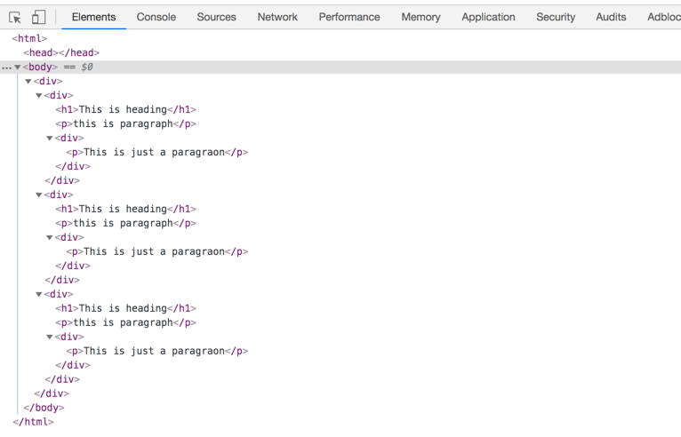

When it comes to SPA applications, you load the **index.html** for the first time and loads the updated data or another html in that **index.html** itself**.** As users navigate through the site, we update the same index.html with the new content. Every time the DOM changes, browser need to recalculate the CSS, do layout, and repaint the web page.

React uses **Virtual DOM** to reconstruct the DOM efficiently. It makes a very complicated and time-consuming task of DOM manipulation easier for us. React abstracts away all this from developers to build efficient UI with the help of Virtual DOM.


#### How Does Virtual DOM Works

Virtual DOM is nothing but the javascript object representation of real DOM. Updating javascript objects is easier and faster when compared with updating the real DOM. With this in mind let’s see how it works.

React keeps the entire copy of DOM as a virtual DOM

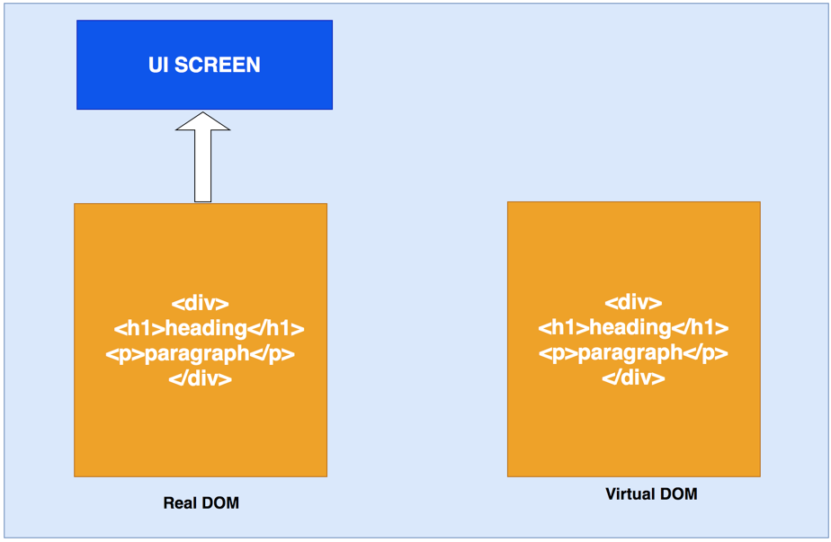


Whenever there is an update comes, it maintains two virtual DOMs to compare the previous state and current state and figures out what objects have been changed. For instance, paragraph text changed to change.

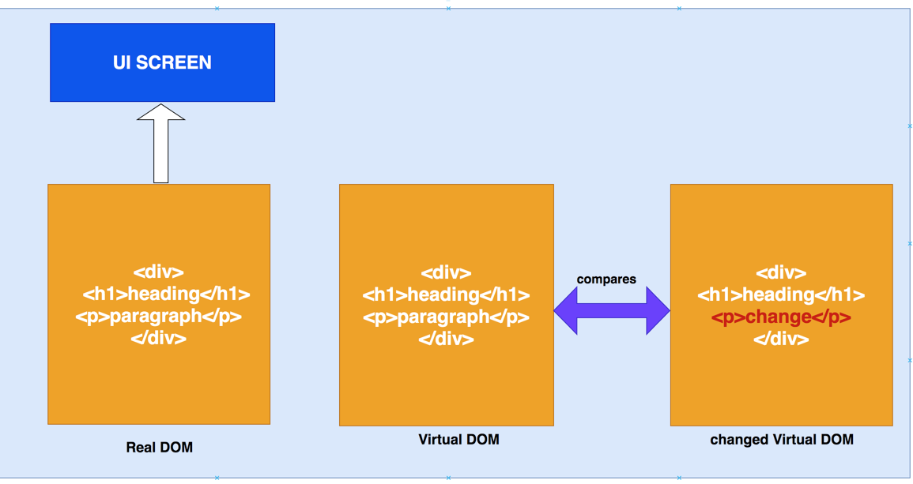

Now it finds out the changes by comparing two virtual DOMs and send those updates to real DOM

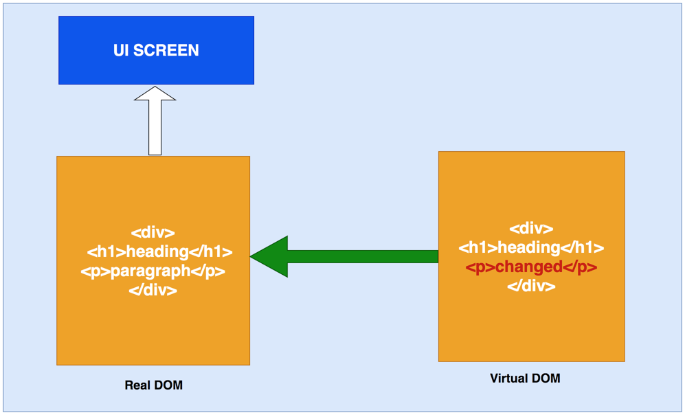

Once real DOM updates, it updates the UI as well

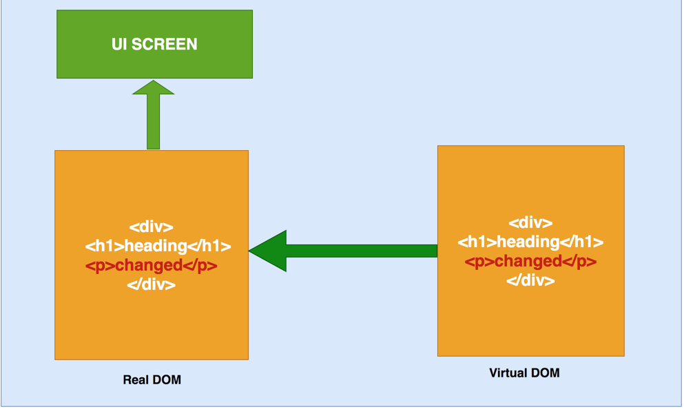


### What is JSX

JSX is a syntax extension to javascript. It’s like a template language with the full power of javascript. It produces React elements which will be rendered in the DOM. React recommends using JSX for the components. In JSX, we combine both javascript and HTML and produces react elements which can be rendered in the DOM.

Here is an example of JSX. We can see how we are combining javascript and HTML. If there is any dynamic variable included in the HTML, we should use the expression language `{}.`

```javascript
// header.js
import React from 'react';

export const Header = () => {

    const heading = 'TODO App'

    return(
        <div style={{backgroundColor:'orange'}}>
            <h1>{heading}</h1>
        </div>
    )
}
```

### **Components and Different Types**

Everything is a component in React. We usually break up the entire logic of the application into small individual pieces. We call each individual piece as a component. In general, A component is a javascript function which takes the input, process it and returns React element which renders in the UI.

There are different types of components in the React. Let’s see those in detail.

#### Functional/Stateless/Presentational Components

A functional or stateless component is a pure function which takes props or no props and returns the react element. These are pure functions which don’t have any side effects. These components don’t have state or lifecycle methods. Here is an example.


```javascript
// header.js
import React from 'react';
import Jumbotron from 'react-bootstrap/Jumbotron';

export const Header = () => {
    return(
        <Jumbotron style={{backgroundColor:'orange'}}>
            <h1>TODO App</h1>
        </Jumbotron>
    )
}
```

#### Class/Stateful Components

Class or Stateful components have state and lifecycle methods and it can change the state of the component with the help of `this.setState()`. Class components are created by extending the `React.Component` and it is initialized in the constructor and might have child components as well. Here is an example.


```javascript
// dashboard.js
import React from 'react';
import '../App.css';
import { ToDoForm } from './todoform';
import { ToDolist } from './todolist';

export class Dashboard extends React.Component {

  constructor(props){
    super(props);

    this.state = {

    }
  }
  
  render() {
    return (
      <div className="dashboard"> 
          <ToDoForm />
          <ToDolist />
      </div>
    );
  }
}
```


#### Controlled Components

Controlled components is a technique which handles input forms in React. Form elements typically maintain their own state and react maintains state in the state property of the component. We can combine both to control the input forms. This is called a controlled component. So, In controlled component form data is handled by React component.

Here is an example. when the user enters the name in the todo item and we are invoking a javascript function `handleChange`to capture the data for every keystroke and putting it in the state so that we can use that data from the state in the `handleSubmit.`

```javascript
// form.js
import React from 'react';
import Form from 'react-bootstrap/Form';
import Button from 'react-bootstrap/Button';
import Row from 'react-bootstrap/Row';
import Col from 'react-bootstrap/Col';

export class ToDoForm extends React.Component {
    constructor(props) {
      super(props);
      this.state = {value: ''};
  
      this.handleChange = this.handleChange.bind(this);
      this.handleSubmit = this.handleSubmit.bind(this);
    }
  
    handleChange(event) {
      this.setState({value: event.target.value});
    }
  
    handleSubmit(event) {
      alert('A name was submitted: ' + this.state.value);
      event.preventDefault();
    }
  
    render() {
      return (
          <div className="todoform">
            <Form>
                <Form.Group as={Row} controlId="formHorizontalEmail">
                    <Form.Label column sm={2}>
                    <span className="item">Item</span>
                    </Form.Label>
                    <Col sm={5}>
                        <Form.Control type="text" placeholder="Todo Item" />
                    </Col>
                    <Col sm={5}>
                        <Button variant="primary" type="submit">Add</Button>
                    </Col>
                </Form.Group>
            </Form>
         </div>
      );
    }
  }
```

#### **UnControlled Components**

Most of the times it is recommended to use controlled components. There is an alternative approach called uncontrolled components to handle form data for this by using `Ref.` In Uncontrolled Components, `Ref` is used to directly access the form values from the DOM instead of event handlers.

Here is an example. We built the same form with the`Ref` instead of using React state. we define the Ref with `React.createRef()` and pass that input form and accessing the form values directly from the DOM in the `handleSubmit` method.


```javascript
// form.js
import React from 'react';
import Form from 'react-bootstrap/Form';
import Button from 'react-bootstrap/Button';
import Row from 'react-bootstrap/Row';
import Col from 'react-bootstrap/Col';

export class ToDoForm extends React.Component {
    constructor(props) {
      super(props);
      this.state = {value: ''};
      this.input = React.createRef();
  
      this.handleSubmit = this.handleSubmit.bind(this);
    }
  
    handleSubmit(event) {
      alert('A name was submitted: ' + this.input.current.value);
      event.preventDefault();
    }
  
    render() {
      return (
          <div className="todoform">
            <Form>
                <Form.Group as={Row} controlId="formHorizontalEmail">
                    <Form.Label column sm={2}>
                    <span className="item">Item</span>
                    </Form.Label>
                    <Col sm={5}>
                        <Form.Control type="text" placeholder="Todo Item" ref={this.input}/>
                    </Col>
                    <Col sm={5}>
                        <Button variant="primary" onClick={this.handleSubmit} type="submit">Add</Button>
                    </Col>
                </Form.Group>
            </Form>
         </div>
      );
    }
  }
```

#### Container Components

Container components are the components which deal with fetching data, subscribing to the redux store, etc. They contain presentational components and other container components. But they never have html in it.

#### Higher order Components

Higher order components are the components which take a component as an argument and produces another component. Redux `connect` is the example of a higher order component. This is a powerful technique for producing reusable components.


### **Props and State**

Props are read-only properties which are passed to the components to render the UI and with the state, we can change the output of the component over time.

Here is an example of a class component which has both props and state defined in the constructor and whenever you modify the state with `this.setState(),` render( ) function will be called again to change the output of the component in the UI.

```javascript
// test.js
import React from 'react';
import '../App.css';

export class Dashboard extends React.Component {

  constructor(props){
    super(props);

    this.state = {
        name: "some name"
    }
  }

  render() {

    // reading state
    const name = this.state.name;

    //reading props
    const address = this.props.address;

    return (
      <div className="dashboard"> 
          {name}
          {address}
      </div>
    );
  }
}
```

### **What are PropTypes**

Type-checking is important as your app grows bigger and bigger over time. PropTypes provides type checking for your components and serves as nice documentation to the other developers. It’s always recommended to add PropTypes for your component if your react project is not in Typescript.

We can also define the Default Props for each component to display if the component doesn’t receive any props. Here is an example. UserDisplay has three props: name, address, and age and we are defining default props and prop types for those.

```javascript
// userdisplay.js
import React from 'react';
import PropTypes from 'prop-types';

export const UserDisplay = ({name, address, age}) => {

    UserDisplay.defaultProps = {
        name: 'myname',
        age: 100,
        address: "0000 onestreet"
    };

    return (
        <>
            <div>
                <div class="label">Name:</div>
                <div>{name}</div>
            </div>
            <div>
                <div class="label">Address:</div>
                <div>{address}</div>
            </div>
            <div>
                <div class="label">Age:</div>
                <div>{age}</div>
            </div>
        </>
    )
}

UserDisplay.propTypes = {
    name: PropTypes.string.isRequired,
    address: PropTypes.objectOf(PropTypes.string),
    age: PropTypes.number.isRequired
}
```

### **How to Update State and How not to**

You should not modify the state directly. The only place you can assign to the state is in the constructor. Using the state directly doesn’t trigger the re-rendering. React merges the state when we use `this.setState().`


```javascript
//  wrong way
this.state.name = "some name"
// right way
this.setState({name:"some name"})
```

It’s always safe to use the second form of `this.setState()` because props and state updated are asynchronous. Here we are updating the state based on the props.

```javascript
// wrong way
this.setState({
    timesVisited: this.state.timesVisited + this.props.count
})
// right way
this.setState((state, props) => {
    timesVisited: state.timesVisited + props.count
});
```

### **Component Lifecycle Methods**

Component goes through a series of lifecycle methods as it enters and leaves the DOM. Here are those lifecycle methods.

#### componentWillMount()

This lifecycle method is called, as the component enters the DOM and you have the last chance to edit the state so that it will be displayed on the screen. It occurs only once.

#### componentDidMount()

This lifecycle method is called when the component entered the DOM and you can call the API in this lifecycle. It occurs only once.

#### componentWillReceiveProps()

Whenever there is a change in the props, the component enters into the update phase. This lifecycle method is called to receive the props and you can check the previous props and current props here and you can update the state depending on the result.

#### shouldComponentUpdate()

This lifecycle method is called whenever there is an update to the props or state and it returns a boolean value true by default. You can return false if you don’t want to rerender the DOM for this change. This is really useful to improve the performance of the app.

#### componentWillUpdate()

Whenever there is a change in the props or state, this lifecycle method is called. We can have a chance to access the state and edit it before rendering the UI.

#### componentDidUpdate()

This lifecycle method is called when the update to the component is completed. Never call `this.setState()` in this lifecycle method.

#### componentWillUnMount()

This lifecycle method is called before the component gets removed from the DOM. This is the right place to remove all the third party libs or clear all the events.

#### **getDerivedStateFromError()**

This lifecycle method is used in ErrorBoundary class. Actually, any class becomes ErrorBoundary if it uses this lifecycle method. This is used to render the fallback UI if something goes wrong in the component tree instead of displaying some weird errors on the screen.

#### componentDidCatch()

This lifecycle method is used in ErrorBoundary class. Actually, any class becomes ErrorBoundary if it uses this lifecycle method. This is used to log the errors if something goes wrong in the component tree.


### **Composition Over Inheritance**

In React, We always use Composition over Inheritance. We already discussed what is composition in the Functional programming section. This is a technique of combining simple reusable functions to generate a higher-order component. Here is an example of composition, we are using two small components `todoForm` and `todoList` in the dashboard component.

```javascript
// dashboar.js
import React from 'react';
import '../App.css';
import { ToDoForm } from './todoform';
import { ToDolist } from './todolist';

export class Dashboard extends React.Component {

  render() {
    return (
      <div className="dashboard"> 
          <ToDoForm />
          <ToDolist />
      </div>
    );
  }
}
```

### **How to Apply Styles In React**

There are three ways to apply styles to React components.


#### External Stylesheet

In this method, you can import external stylesheet into your component use classes. **But you should use** `className` **instead of** `class` **to apply styles for the React elements.** Here is an example.


```javascript
// app.js
import React from 'react';
import './App.css';
import { Header } from './header/header';
import { Footer } from './footer/footer';
import { Dashboard } from './dashboard/dashboard';
import { UserDisplay } from './userdisplay';

function App() {
  return (
    <div className="App">
      <Header />
      <Dashboard />
      <UserDisplay />
      <Footer />
    </div>
  );
}

export default App;
```


#### Inline Style

In this method, we can directly pass props to the HTML elements with the property called `style.` Here is an example. **The important thing we should notice here is that we are passing javascript object to the** `style` **prop that’s why we are using** `backgroundColor` **instead of CSS way** `background-color`.

```javascript

import React from 'react';

export const Header = () => {

    const heading = 'TODO App'

    return(
        <div style={{backgroundColor:'orange'}}>
            <h1>{heading}</h1>
        </div>
    )
}
```


#### Define a Style Object and use it

Since we are passing javascript object to the `style` property, we can define a style object in the component and use it. Here is an example and you can pass this object down the component tree as props as well.

```javascript
// footer.js
import React from 'react';

const footerStyle = {
    width: '100%',
    backgroundColor: 'green',
    padding: '50px',
    font: '30px',
    color: 'white',
    fontWeight: 'bold'
}

export const Footer = () => {
    return(
        <div style={footerStyle}>
            All Rights Reserved 2019
        </div>
    )
}
```


### **What is Redux and How It Works**

Redux is a state management library for the React and it is based on flux. Redux facilitates the one way data flow in React. Redux abstracts state management away from React entirely.

#### How it Works

In React, Components are connected to the redux store and if you want to access the redux store, you need to dispatch an action containing id and payload. The payload in the action is optional. Actions forward it to Reducers.

When the reducer receives the action, it compares the action id with the predefined case statements. When it matches, it changes the state accordingly for the corresponding action and returns a new state.

When the Redux state changes, components connected to the redux store will receive new state as the props. When the component receives the props, it will get into the update phase and rerenders the UI.


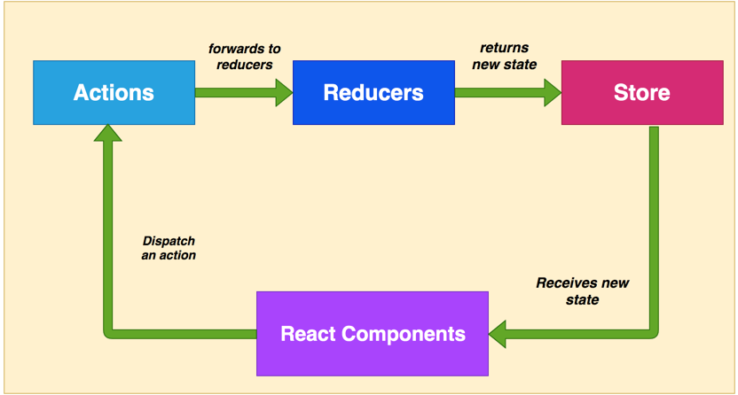

#### Redux Cycle In Detail

Let’s see the whole redux cycle in detail.

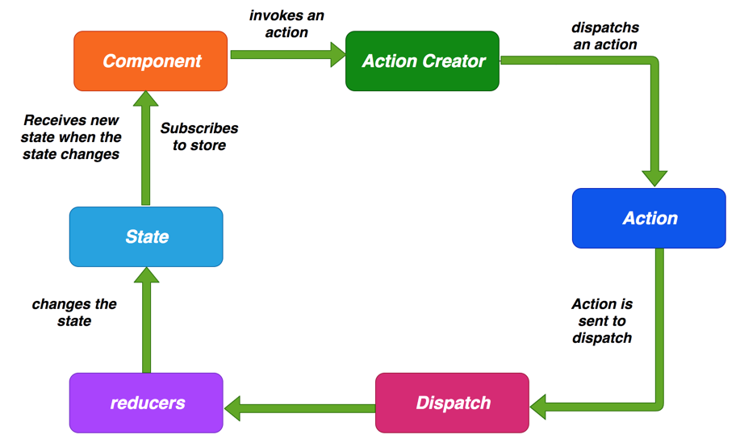


**Action:** Action is nothing but a simple json object with **type** and **payload** as keys. Type is mandatory and the payload is optional here. Here is an example of action.

```javascript
// action

{ 
  type:"SEND_EMAIL", 
  payload: data
};
```


**Action Creators:** These are the functions which create **Actions** so that we don’t have to write every action manually in our component when we dispatch an action. Here is an example of an action creator.

```javascript
// actioncreator.js
// action creator

export function sendEamil(data) {
    return { type:"SEND_EMAIL", payload: data};
}
```


**Reducers:** Reducers are the pure functions which takes the action and current state as arguments and compute the necessary logic and returns a new state. These Reducers doesn’t have any side effects. It doesn’t mutate the state instead always returns state. Here is an example.

```javascript
// reducer.js
export default function emailReducer(state = [], action){
 
  switch(action.type) {
      case "SEND_EMAIL":  return Object.assign({}, state, {
       email: action.payload
      });
      default: return state;
  }
}
```

#### **How component connects with redux store**

**mapStateToProps:** This function maps state to your props so whenever there is a change in the state you receive the new state as props. This is how you subscribe to the store.

**mapDispatchToProps:** This function is used to bind your action creators to your props so that we can dispatch an action using `this.props.actions.sendEmail()` in line 12.

`connect` and `bindActionCreators` are from the redux library. The former is used to connect to the store like line number 22 and the latter is used to bind your action creators to your props like line number 20.

```javascript
// component.js
// import connect
import { connect } from 'react-redux'
import { bindActionCreators } from 'redux'

// import action creators
import * as userActions from '../../../actions/userActions';

export class User extends React.Component {
  
    handleSubmit() {
        // dispatch an action
        this.props.actions.sendEmail(this.state.email);
    }
  
}

// you are mapping you state props
const mapStateToProps = (state, ownProps) => ({user: state.user})
// you are binding your action creators to your props
const mapDispatchToProps = (dispatch) => ({actions: bindActionCreators(userActions, dispatch)})

export default connect(mapStateToProps, mapDispatchToProps)(User);
```


### **What is React Router Dom and How It Works**

We navigate through pages in the large web applications and react-router-dom is the library for the routing in the App. Routing capabilities don’t come with React library, we have to install `react-router-dom` separately. You need to install React for the `react-router-dom` to work.

**react-router-dom** provides two routers `BrowserRouter` and `HashRoauter.`The former is used if you have a server serving static pages and the latter is used if you have a static file server.

#### react-router-dom components

- `BrowserRouter` and `HashRouter` are the routers.
- `Route` is used for the route matching.
- `Link` component is used to create links in the application. It will be rendered as anchor tag in the HTML.
- `NavLink` is the special link which highlights the currently active link.
- `Switch` is not required but it is useful when combining routes.
- `Redirect` is used to force the navigation in the component

Here is an example of `Link,` `NavLink` and `Redirect` in the component


```html
// component.js
// normal link
<Link to="/gotoA">Home</Link>

// link which highlights currentlu active route with the given class name
<NavLink to="/gotoB" activeClassName="active">
  React
</NavLink>

// you can redirect to this url
<Redirect to="/gotoC" />
```

Here is an example of the react router component. If you look at the below example we are matching the path and renders the appropriate component by using `Switch` and `Route.`

```javascript
// layout.js
import React from 'react'
// import react router DOM elements
import { Switch, Route, Redirect } from 'react-router-dom'
import ComponentA from '../common/compa'
import ComponentB from '../common/compb'
import ComponentC from '../common/compc'
import ComponentD from '../common/compd'
import ComponentE from '../common/compe'


const Layout = ({ match }) => {
    return(
        <div className="">
            <Switch>
                <Route exact path={`${match.path}/gotoA`} component={ComponentA} />
                <Route path={`${match.path}/gotoB`} component={ComponentB} />
                <Route path={`${match.path}/gotoC`} component={ComponentC} />
                <Route path={`${match.path}/gotoD`} component={ComponentD} />
                <Route path={`${match.path}/gotoE`} component={ComponentE} />
            </Switch>
        </div>
    )}

export default Layout
```


### **What are Error Boundaries**

In React, we usually have a component tree. If an error happens in any one of the components, it will break the whole component tree. There is no way of catching these errors. We can gracefully handle these errors with Error Boundaries.

Error Boundaries does two things

- display fallback UI if an error occurs
- lets you log errors

Here is an example of ErrorBoundary Class. Any class becomes ErrorBoundary if it implements any of these lifecycle methods `getDerivedStateFromError` or `componentDidCatch.` The former returns `{hasError: true}` to render the fallback UI and the latter is used to log the errors.


```javascript
// errorboundary.js
import React from 'react'

export class ErrorBoundary extends React.Component {
    constructor(props) {
      super(props);
      this.state = { hasError: false };
    }
  
    static getDerivedStateFromError(error) {
      // Update state so the next render will show the fallback UI.
      return { hasError: true };
    }
  
    componentDidCatch(error, info) {
      // You can also log the error to an error reporting service
      console.log('Error::::', error);
    }
  
    render() {
      if (this.state.hasError) {
        // You can render any custom fallback UI
        return <h1>OOPS!. WE ARE LOOKING INTO IT.</h1>;
      }
  
      return this.props.children; 
    }
  }
```


Here is how we can use ErrorBoundary in one of the components. I am wrapping `ToDoForm` and `ToDoList` with the `ErrorBoundary` class. If any error occurs in these components we log the errors and display fallback UI.


### **What are Fragments**

In React, we need to have a parent element while returning react elements from the component. Sometimes it is annoying to put an extra node into the DOM. With Fragments, we don’t have to put an extra node into the DOM. All we need to warp the content with `React.Fragment` or with shorthand notation `<>.`

Here is an example. WithFragments, we don’t have to put an extra div if it’s not necessary.


```javascript
// fragment.js

 // Without Fragments   
return (
    <div>
       <CompoentA />
       <CompoentB />
       <CompoentC />
    </div>
)

// With Fragments   
  return (
    <React.Fragment>
       <CompoentA />
       <CompoentB />
       <CompoentC />
    </React.Fragment>
  )

  // shorthand notation Fragments   
  return (
    <>
       <CompoentA />
       <CompoentB />
       <CompoentC />
    </>
  )
```


### **What are Portals**

By default, all the child components render on the UI depending on the component Hierarchy. Portals make it possible to render component children outside of DOM hierarchy of parent component.

Here is an example. By default, parent component has children component in the DOM hierarchy.

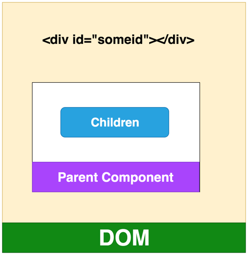

We can move the children components out of the parent component and attach it to the DOM node id`someid.` Let’s see that in action.

First, we get the reference id and we create an element `div` in the `constrcutor`and append child to that `someRoot` in the `componentDidMount.`Finally, we pass children to that particular DOM node with the help of `ReactDOM.createPortal(this.props.childen), domnode).`

```javascript
// portal.js

const someRoot = document.getElementById('someid');

class Modal extends React.Component {
  constructor(props) {
    super(props);
    this.el = document.createElement('div');
  }

  componentDidMount() {
    someRoot.appendChild(this.el);
  }

  componentWillUnmount() {
    someRoot.removeChild(this.el);
  }

  render() {
    return ReactDOM.createPortal(
      this.props.children,
      this.el,
    );
  }
}

```

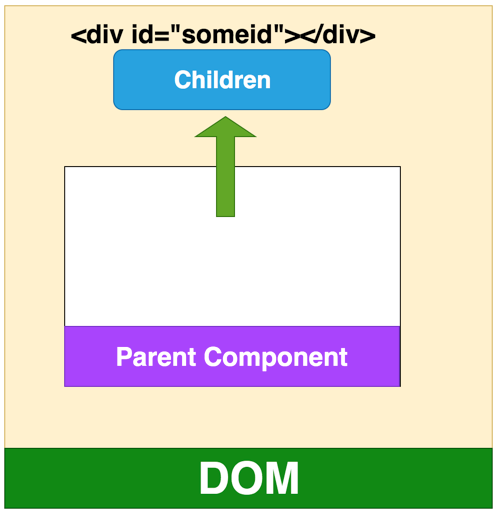

### **What is Context**

Sometimes we have to pass the props down the component tree even though all the middle components don’t need those. Context is a way to pass the props without passing down the component tree on every level.

------

### **What are Hooks**

Hooks is the new feature in the React from version 16.8. Remember we can’t use the state in functional components since these are not class components. **Hooks make it possible to use state and other features in functional components without a class.**

There are no breaking changes at this time and we don’t have to abandon out class components yet. With Hooks, you can take out the stateful logic and can be tested independently and they let you use React without classes. There are a bunch of hooks that we can use such as `useState,` `useEffect,``useContext,` `useReducer,` etc.

Here are the fundamental rules of Hooks

- Hooks should be used at the top level and should not be used inside loops, conditions or nested functions
- Hooks should only be used in functional components. Another valid place is your own custom hook.

Let’s see one example to understand the hooks. This is a functional component which takes props and displays those on the UI. With the help of a useState hook, we converted this functional component into the stateful component. First, we define the state in line 5. This is equivalent to

```javascript
// test.js
constructor(props) {
 super(props);
 this.state = {
     name:'myname', age:10, address:'0000 one street'
 }
}
```

`useState` returns two items one is `user`and another one is `setUser` function. `user` is an object which can be used directly without `this` keyword and `setUser` is a function which can be used to set the state which the user clicks on the button in line 21. This function is equivalent to the following.

```javascript
// state.js
this.setState({name:'name changed'})
```

```javascript
// userdisplay.js
import React, { useState } from 'react';

export const UserDisplay = ({name, address, age}) => {

    const [user, setUser] = useState({ name: 'myname', age: 10, address: '0000 onestreet' });

    return (
        <>
            <div>
                <div class="label">Name:</div>
                <div>{user.name}</div>
            </div>
            <div>
                <div class="label">Address:</div>
                <div>{user.address}</div>
            </div>
            <div>
                <div class="label">Age:</div>
                <div>{user.age}</div>
            </div>
            <button onClick={() => setUser({name: 'name changed'})}>
                Click me
            </button>
        </>
    )
}
```

### **How to Improve Performance**

There are a number of ways that we can improve app performance. Here are the important ones.

- Always use `shouldComponentUpdate` lifecycle method appropriately. It avoids unnecessary rendering for the child components. If you have 100’s of components down the tree, not re-rendering the entire component tree definitely improves app performance.
- Always use `create-react-app` to scaffold the project, this creates the entire project structure out of the box with a lot of optimizations.
- Immutability is the key to improve performance. Instead of mutating the data, always create new collections on top of existing ones **to keep the copying minimum** which would improve performance.
- Always use Keys when you are displaying lists or table, This makes React does updates much faster.
- Make sure you ship the production build for the production.
- Code Splitting is the technique of diving the code into separate files and load only those files which are necessary for that module or section.

### **How to Persist data when reloading the page**

Single Page Applications load the `index.html` in the DOM first and then load the content as the user navigates through the pages or gets any data from the backend API in the same index.html.

If you reload the page `index.html` by hitting the reload button in the browser, the entire React app reloads and we will lose the state of the application. How can you preserve the app state?

We use the Browser `localstorage`to preserve the state of the application whenever we reload the app. We keep the entire store data in the localstorage and whenever there is a page refresh or reload, we load the state from the localstorage.

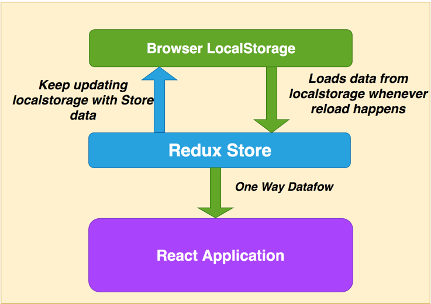

### **How do you make an API call from React**

We use redux-thunk to call the API in React. Since reducers are pure functions, there should not be any side effects such as calling an API. So, we have to make the API call from the action creators using redux-thunk. Action creator dispatches an Action putting the data from the API in the payload of action. Reducers receive the data as we discussed in the redux cycle above and the rest of the process is the same as well.

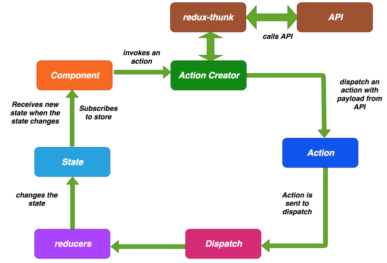

`redux-thunk` is a middleware. Once it is included in the project, every time you dispatch an action and this dispatch is passed through the thunk. If it’s a function and it just waits until the function process and returns the response. If it’s not a function it just processes normally.

Here is an example. `sendEmailAPI` is the function called from the component and takes a data and returns function with `dispatch` as an argument. We are using `redux-thunk` to call the API `apiservice` and waits until the response received. Once the response is received, we dispatch an action with the payload.

```javascript
// actioncreator.js
import apiservice from '../services/apiservice';

export function sendEmail(data) {
    return { type:"SEND_EMAIL", payload: data };
}

export function sendEmailAPI(email) {
    return function(dispatch) {
        return apiservice.callAPI(email).then(data => {
            dispatch(sendEmail(data));
        });
    }
}
```

